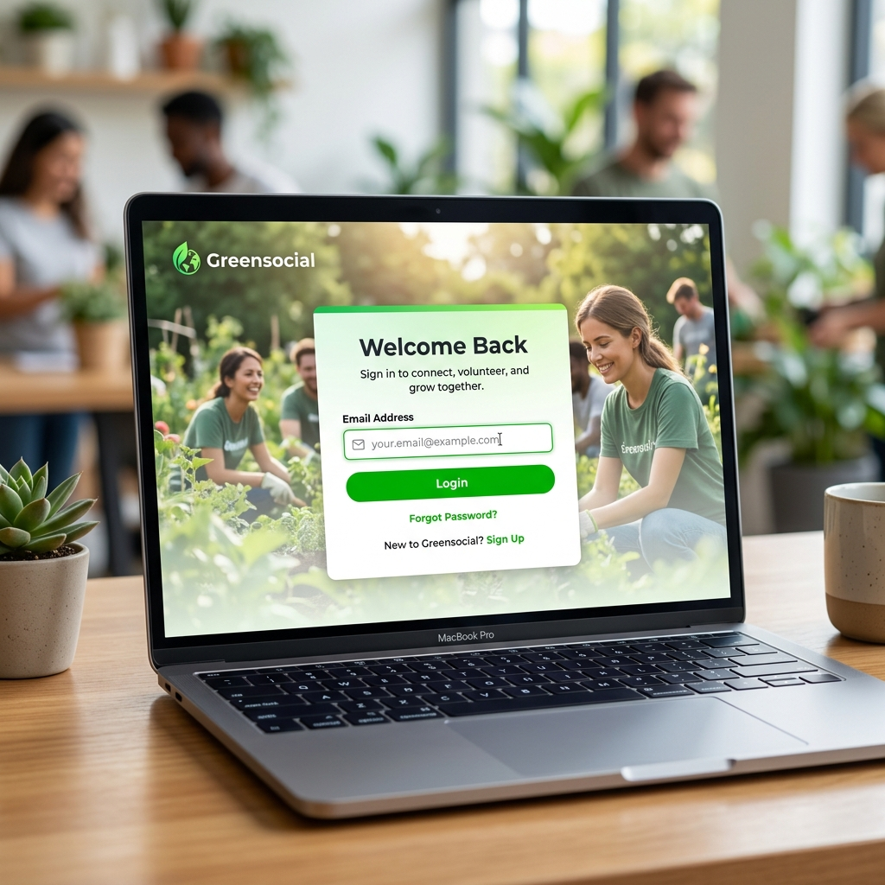
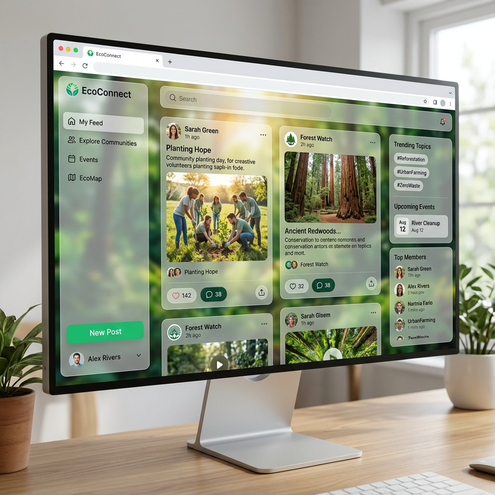
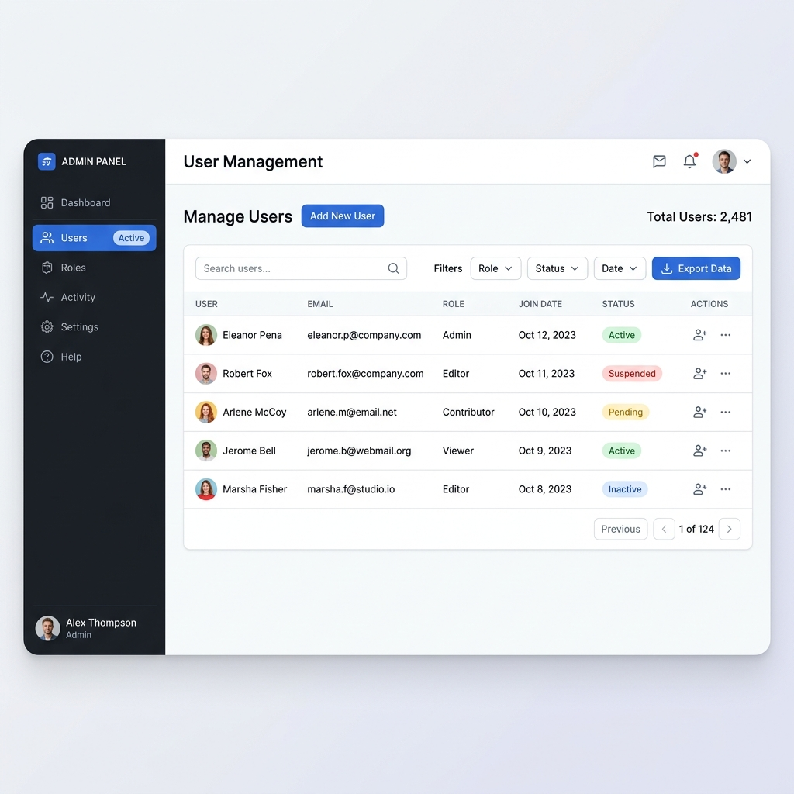

# 🍃 Greensocial - Guia Definitivo do Usuário

Bem-vindo(a) ao **Greensocial**, a plataforma web super premium projetada especificamente para empoderar a sua comunidade de voluntários! Pensando na facilidade e no engajamento ecológico, montamos esta plataforma para reunir todas as vozes dos participantes da ONG em uma única rede segura e moderna.

Este manual é um documento aprofundado, cobrindo todos os módulos vitais para que você entenda exatamente onde clicar e como tirar o melhor proveito do Greensocial.

---

## 1. Login e Acesso Seguro

O sistema é 100% restrito a pessoas validadas pelos líderes do projeto, então você não encontrará botões de "Criar Conta". Isso preserva a segurança militar dos seus dados!

1. Quando você abrir o aplicativo no seu celular ou computador, verá primeiro a tela de Identificação.
2. Escreva o seu **E-mail Oficial** no campo principal e aperte **ENTRAR**. 
3. *Não há senha?* Correto! O acesso à nossa plataforma utiliza a moderna arquitetura de "Identificação Única Criptografada" em vez de senhas convencionais. Seu e-mail basta para liberar o que a diretoria autorizou para o seu usuário.
4. Caso a caixa exiba "Email não encontrado", significa que a gerência ainda não cadastrou sua ficha. Contate a secretária da ONG.

---

## 2. O Coração da Plataforma: Feed Social

O "Feed de Projetos" é muito parecido aos aplicativos que você já utiliza no dia a dia, para você se sentir em casa imediatamente.

### Realizando Postagens Impactantes
No topo superior, logo abaixo das "Boas Vindas", encontre a caixa **"Compartilhe suas atualizações!"**.
* Escreva sobre o terreno que foi capinado, o filhote de animal resgatado, ou qualquer feito para a comunidade.
* Clique no ícone verde escuro de "Clipes" e selecione fotos. (O Greensocial redimensiona as pesadas fotos do celular automaticamente, para não gastarmos muito da internet!).

### Controle Dinâmico: Edição Rápida
Todo voluntário é dono absoluto das suas falas.
Caso identifique que errou uma letra num post, ou se esqueceu de mencionar alguém num comentário, procure os famosos **"Três Pontinhos" (...)** no canto superior do balão da sua mensagem.
Ao clicar na "Canetinha" (Editar), a moldura brilha em evidência verde e, em um piscar, seu texto será corrigido sem você precisar apagar a publicação toda!

---

## 3. Mensageiro Privado e Criptografado (Chat)

Notou o ícone de conversas "Mensagens" na barra lateral? É ali que os voluntários coordenam caronas, suprimentos ou tiram dúvidas sigilosas.

* **Busca e Lista Rápida**: Assim que entra no Chat, você nota do lado esquerdo o campo `Procurar voluntário...`. Achou a pessoa? É só clicar nela. 
* **Conversa Dinâmica**: Escreva sua mensagem na barra inferior e toque na tecla **"Enter"** do teclado (ou no botão).
* **Edição Extra:** Não é só no Feed que você tem poderes para gerenciar sua escrita. O Chat é interativo! Passe suavemente o seu mouse pelas bolhas verdes (as que você publicou) e descubra as opções instantâneas de **Editar** ou **Excluir** flutuando!
* **A Segurança invisível:** Nem mesmo os engenheiros ou o provedor de internet conseguem ler as trocas de chat. Os balões do Greensocial trafegam em Criptografia de nível Ouro (AES-256 Data-at-Rest), de forma que no banco de dados só se leem códigos emaranhados e impronunciáveis. A sua privacidade não é luxo, é regra!

---

## 4. O Dashboard do Gestor (Admin)

Caso você seja promovido a Diretor ou Administrador Geral da ONG, duas abas inéditas surgirão: "Gestão" e "Relatórios de Comunicação". Apenas o Administrador sabe da existência dessa camada restrita.

### Tabela de Equipe Completa
Onde era um feed de conversas, torna-se uma tabela limpa e clara.
* Cadastre o e-mail, nome, telefone oficial, data de nascimento e habilidades de um voluntário que está conhecendo a ONG. Tudo isso ficará indexado para fácil busca.
* A pessoa se afastou do projeto? Ajuste o *Status* para "Inativo" no botão da engrenagem. Dessa forma, ela não é bloqueada, apenas não acessará a conta provisoriamente.
* Deseja os dados cruéis puros? Aperte o botão azulão **Exportar XLSX** e receba e baixe todas essas informações numa planilha Excel pronta para confecção de crachás!

### Robô Semanal de Notícias (Newsletter)
Chega de montar malas-diretas no velho computador e demorar horas copiando e-mails!
O aplicativo entende quem é da comunidade e pode enviar boletins (Comunicação de Reuniões aos fins de semana, etc). 
* **O Relatório Mágico de Segunda:** Toda segunda de manhãzinha o Greensocial te dispara a "Auditoria", onde um robô avalia quantas notificações os voluntários vêm abrindo, quem pediu para se descadastrar (opt-out do e-mail) e avalia também alertas de inatividades extremas.

---

Sinta-se à vontade para navegar e descobrir as reações mágicas desse ecossistema! Suas rotinas de ações sustentáveis merecem esse refinamento inteligente.
