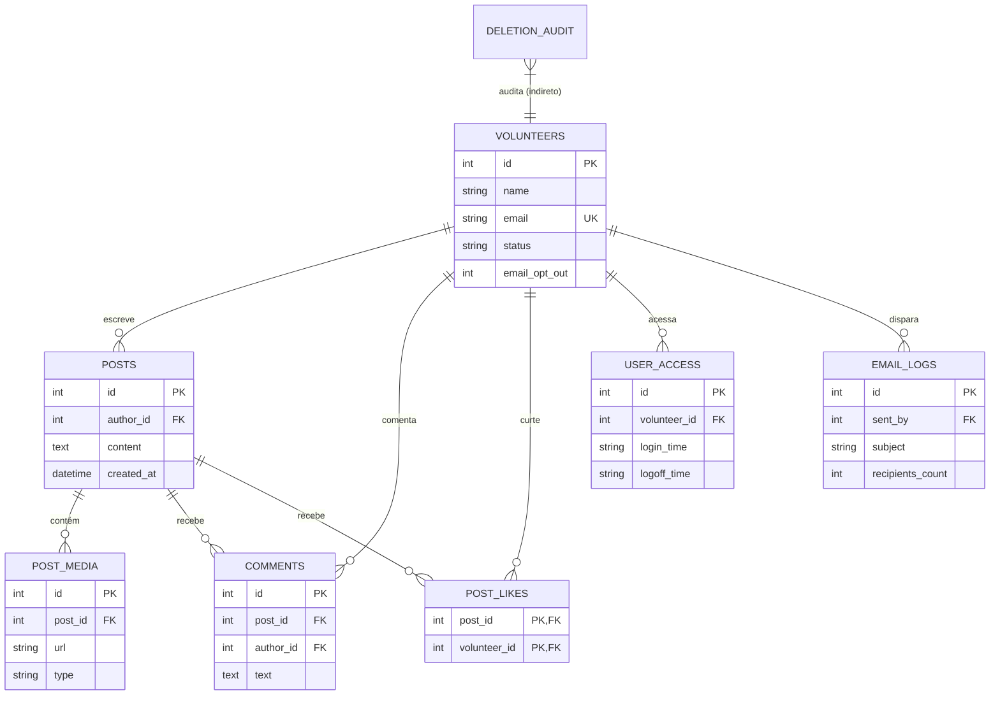

# 📊 Diagrama Entidade-Relacionamento (DER) - Greensocial

Este documento descreve o modelo lógico e as relações entre as tabelas do sistema.

## 🧜‍♂️ Diagrama (Mermaid)

## 🧠 Explicação do Modelo

### 1. Centralidade do Voluntário
A tabela `volunteers` é o núcleo do sistema. Quase todas as outras tabelas se relacionam com ela (Autor de post, autor de comentário, quem logou, quem disparou e-mail).

### 2. Integridade Referencial
O modelo utiliza dois comportamentos principais para garantir que o banco não fique "sujo":
- **CASCADE**: Se um `Post` é excluído, suas `Mídias`, `Comentários` e `Curtidas` somem automaticamente.
- **SET NULL**: Se um `Voluntário` é excluído, seus `Posts` e `Comentários` permanecem no sistema, mas o campo de autor fica vazio (exibindo "Usuário Removido" na interface). Isso preserva o histórico da comunidade.

### 3. Normalização
- **N:N (Muitos para Muitos)**: A relação entre Voluntários e Posts para curtidas é resolvida na tabela `post_likes`. Ela garante que um voluntário não curta o mesmo post duas vezes (Primary Key composta).
- **1:N (Um para Muitos)**: Um post pode ter várias imagens/vídeos através da tabela `post_media`.

## 📈 Tipo de Banco de Dados
- **Tipo**: Relacional / OLTP (Online Transactional Processing).
- **Propriedades**: ACID (Atomicidade, Consistência, Isolamento e Durabilidade).
- **Motor**: SQLite 3.
